# Panduan Konfigurasi Otomatisasi Upload Chrome Web Store (API)

Dokumen ini menjelaskan langkah demi langkah cara menyiapkan kredensial **Chrome Web Store Publish API** agar rilis ekstensi dapat diunggah dan diajukan (*submit for review*) secara otomatis baik via **GitHub Actions** maupun melalui script lokal **Bun**.

Ekstensi Target:
- **Nama**: AW Browser Cleaner
- **Extension ID**: `njflkejajbifofomeebakgebgcincepf`

---

## Ringkasan Alur Kerja

```mermaid
flowchart LR
    A[Git Tag vX.Y.Z] --> B[GitHub Actions Release Workflow]
    B --> C[Bun Test & Build Package]
    C --> D[Generate aw-browser-cleaner.zip]
    D --> E[scripts/upload-cws.js]
    E -->|OAuth2 Token| F[Google Chrome Web Store API]
    F -->|Upload Package| G[CWS Developer Dashboard Draft]
    G -->|Optional Publish| H[Submitted for Review]
```



---

## Langkah 1: Buat Project & Aktifkan Chrome Web Store API

1. Buka [Google Cloud Console](https://console.cloud.google.com/).
2. Buat project baru (misal: `AW-Browser-Cleaner-CWS`) atau pilih project yang sudah ada.
3. Pastikan Anda login dengan akun Google yang sama dengan akun **Chrome Web Store Developer** (atau akun yang memiliki akses publisher ke ekstensi).
4. Buka menu **APIs & Services** > **Library**.
5. Cari **Chrome Web Store API** dan klik **Enable**.

---

## Langkah 2: Konfigurasi OAuth Consent Screen & Buat Kredensial

1. Masuk ke **APIs & Services** > **OAuth consent screen**:
   - Pilih User Type: **External** > klik **Create**.
   - Isi nama aplikasi (misal: `AW Browser Cleaner Publisher`) dan email kontak Anda.
   - Pada bagian **Scopes**, tambahkan scope:
     `https://www.googleapis.com/auth/chromewebstore`
   - Pada bagian **Test users**, tambahkan alamat email akun developer Chrome Anda.
   - Simpan (*Save and Continue*).
2. Masuk ke **APIs & Services** > **Credentials**:
   - Klik **Create Credentials** > **OAuth client ID**.
   - Application type: Pilih **Desktop app** (atau Web application).
   - Beri nama (misal: `CWS CLI Upload`).
   - Klik **Create**.
3. Simpan nilai yang muncul:
   - **Client ID** (contoh format: `xxxx.apps.googleusercontent.com`)
   - **Client Secret** (contoh format: `GOCSPX-xxxx`)

---

## Langkah 3: Dapatkan Refresh Token

Cara termudah adalah menggunakan **Google OAuth 2.0 Playground**:

1. Buka [Google OAuth 2.0 Playground](https://developers.google.com/oauthplayground/).
2. Klik ikon gear (⚙️) di pojok kanan atas:
   - Centang **Use your own OAuth credentials**.
   - Masukkan **OAuth Client ID** dan **OAuth Client Secret** dari Langkah 2.
3. Pada panel kiri (*Step 1: Select & authorize APIs*):
   - Di kotak input "Input your own scopes", masukkan:
     ```text
     https://www.googleapis.com/auth/chromewebstore
     ```
   - Klik tombol biru **Authorize APIs**.
4. Login dan izinkan akses menggunakan akun Google Developer Anda.
5. Pada panel kiri (*Step 2: Exchange authorization code for tokens*):
   - Klik **Exchange authorization code for tokens**.
6. Simpan nilai **Refresh token** yang dihasilkan.

---

## Langkah 4: Konfigurasi GitHub Repository Secrets (Untuk CI/CD)

Agar setiap tag rilis baru (`v1.2.1`, `v1.3.0`, dll.) langsung diunggah otomatis oleh GitHub Actions:

1. Buka repository di GitHub: `https://github.com/ahliweb/chrome-awbrowsercleaner`
2. Masuk ke **Settings** > **Secrets and variables** > **Actions**.
3. Tambahkan 3 secret berikut pada bagian **Repository secrets**:

| Secret Name | Nilai | Wajib? |
| :--- | :--- | :--- |
| `CWS_CLIENT_ID` | OAuth Client ID dari Langkah 2 | Ya |
| `CWS_CLIENT_SECRET` | OAuth Client Secret dari Langkah 2 | Ya |
| `CWS_REFRESH_TOKEN` | Refresh Token dari Langkah 3 | Ya |
| `CWS_EXTENSION_ID` | `njflkejajbifofomeebakgebgcincepf` | Opsional (sudah ada default) |

*(Opsional)* Pada tab **Variables**, Anda dapat menyetel:
- `CWS_AUTO_PUBLISH`: `true` (langsung submit review) atau `false` (hanya upload draft tanpa submit). Default: `true`.

---

## Langkah 5: Penggunaan Lokal via Bun (Opsional)

Jika Anda ingin mengunggah langsung dari komputer lokal tanpa melalui GitHub Actions:

1. Buat file `.env` di root direktori proyek (file ini otomatis diabaikan oleh `.gitignore`):
   ```env
   CWS_CLIENT_ID=isi_client_id_anda
   CWS_CLIENT_SECRET=isi_client_secret_anda
   CWS_REFRESH_TOKEN=isi_refresh_token_anda
   CWS_EXTENSION_ID=njflkejajbifofomeebakgebgcincepf
   ```

2. Jalankan perintah:
   ```bash
   # 1. Build paket rilis terbaru
   bun run build:package

   # 2. Periksa kesiapan tanpa memanggil API (Dry Run)
   bun run upload:cws --dry-run

   # 3. Upload paket ke Chrome Web Store (Draft mode)
   bun run upload:cws

   # 4. Upload dan langsung submit untuk review publik
   bun run upload:cws --publish
   ```

---

## Verifikasi Keamanan

- File `.env`, `.env.*`, `*.pem`, dan `*.key` telah didaftarkan dalam `.gitignore` sehingga kredensial tidak akan pernah ter-commit ke git repository.
- Workflow GitHub Actions menggunakan GitHub Encrypted Secrets dan tidak mencetak nilai rahasia ke build logs.
- Jika secrets belum dikonfigurasi di GitHub, GitHub Actions rilis akan menampilkan peringatan dan melewati langkah upload secara aman (*graceful skip*) tanpa menggagalkan pembuatan rilis GitHub.
